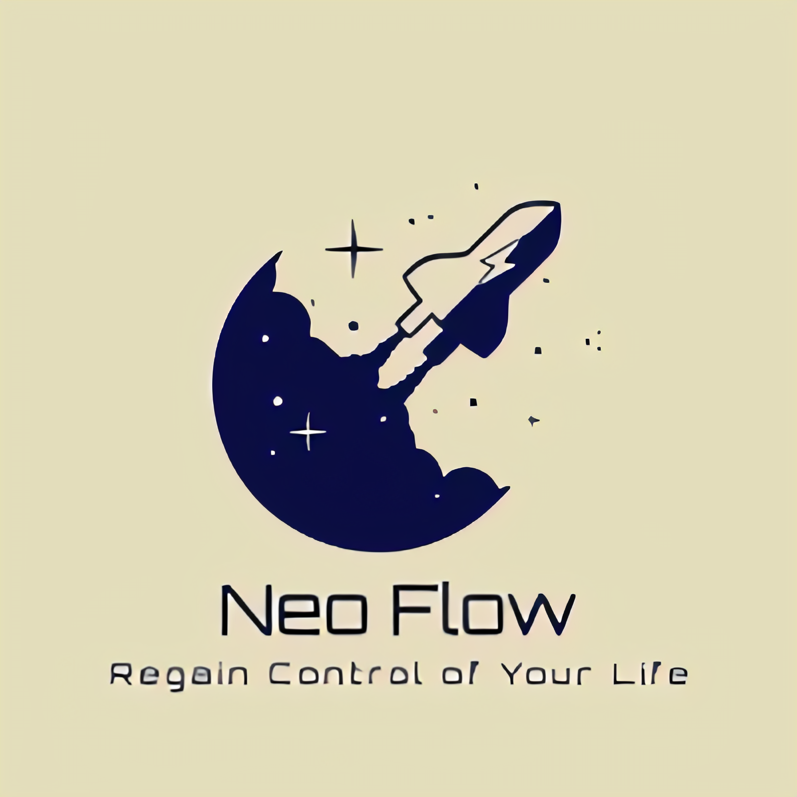
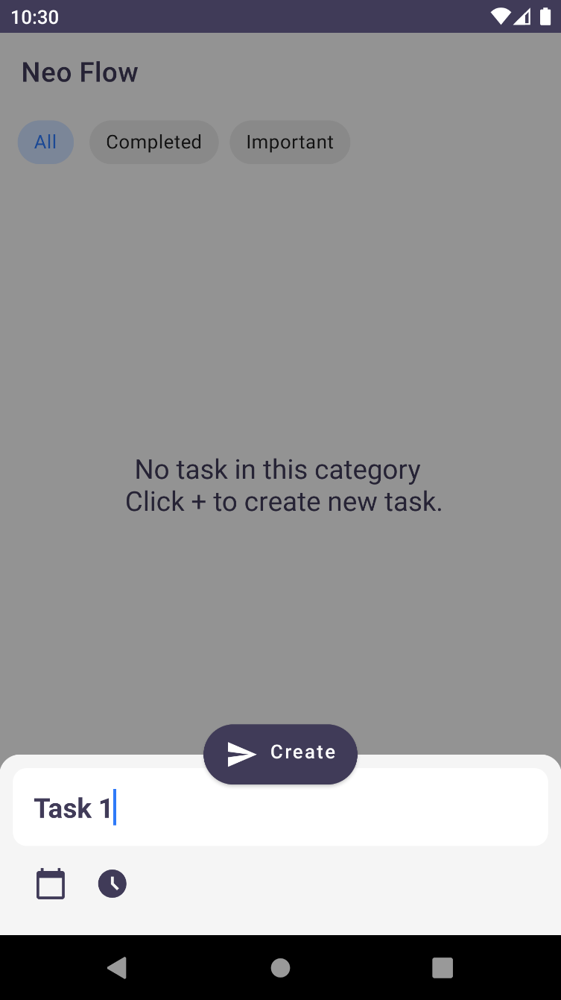
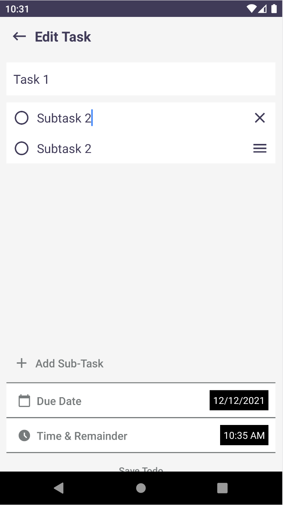
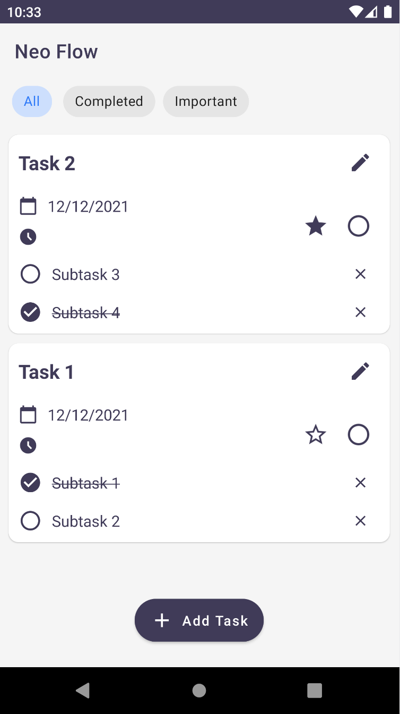
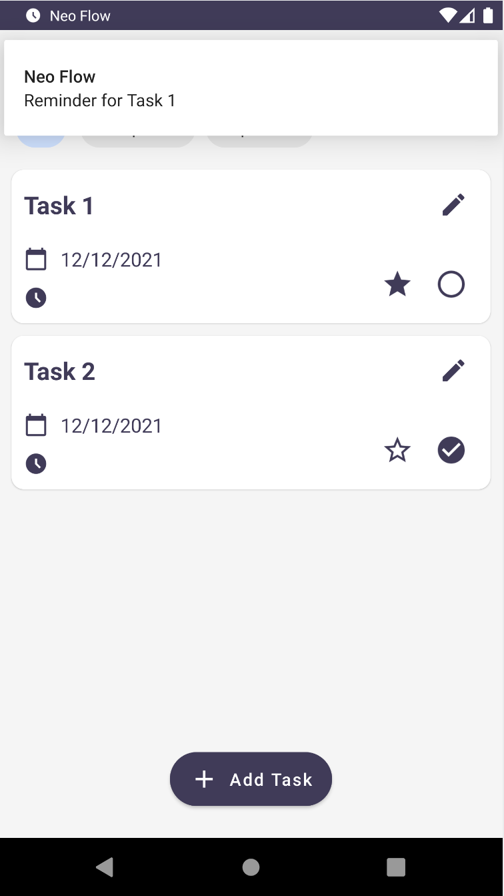

<!-- PROJECT SHIELDS -->

    
    
    

<!-- PROJECT LOGO -->
 

<h2 align="center">Neo Flow</h2>

    A modern GTD Android App to improve your workflow
     
    <a href="https://github.com/Clover-Hill/NeoFlow"><strong>Explore the docs »</strong></a>
     
    <a href="#about-the-project">View Demo</a>
    ·
    <a href="https://github.com/Clover-Hill/NeoFlow/issues">Report Bug</a>
    ·
    <a href="https://github.com/Clover-Hill/NeoFlow/issues">Request Feature</a>

<!-- TABLE OF CONTENTS -->

    
Table of Contents

    <ol>
        <li><a href="#about-the-project">About The Project</a></li>
        <li><a href="#tech-stack">Tech Stack</a></li>
        <li><a href="#download-app">Download APP</a></li>
        <li><a href="#roadmap">Roadmap</a></li>
        <li><a href="#contributing">Contributing</a></li>
        <li><a href="#license">License</a></li>
        <li><a href="#contact">Contact</a></li>
        <li><a href="#acknowledgments">Acknowledgments</a></li>
    </ol>

---
<!-- ABOUT THE PROJECT -->

## About The Project
   

Neo Flow is a modern GTD Android App to improve your workflow.

&ensp;&ensp;*The motivation for this project is that although there already are many GTD apps out there, no app has successfully integrated all features you need during your workflow into only one app. For example, my workflow from a top to bottom sequence: different projects' management, making plan for one day/week/month, pomodoro for every working session, as well as some other featurs like habit tracking and to-do item memo.*
 

(<a href="#top">back to top</a>)

---
## Tech Stack

* [Kotlin](https://kotlinlang.org/) - First class and official programming language for Android development.
* [Coroutines](https://kotlinlang.org/docs/coroutines-overview.html) - For Asynchronous.
* [Flow](https://kotlin.github.io/kotlinx.coroutines/kotlinx-coroutines-core/kotlinx.coroutines.flow/-flow/) - A cold asynchronous data stream that sequentially emits values and completes normally or with an exception.
* [StateFlow](https://developer.android.com/kotlin/flow/stateflow-and-sharedflow) - StateFlow is a state-holder observable flow that emits the current and new state updates to its collectors.
* [Android Architecture Components](https://developer.android.com/topic/architecture) - Collection of libraries that help you design robust, testable, and maintainable apps.
  * [ViewModel](https://developer.android.com/topic/libraries/architecture/viewmodel) - Stores UI-related data that isn't destroyed on UI changes.
  * [ViewBinding](https://developer.android.com/topic/libraries/view-binding) - Generates a binding class for each XML layout file present in that module and allows you to more easily write code that interacts with views.
  * [Room Database](https://developer.android.com/training/data-storage/room) - Room is an android library which is an ORM which wraps android's native SQLite database.
* [Dagger-Hilt](https://dagger.dev/hilt/) - Standard library to incorporate Dagger dependency injection into an Android application.

(<a href="#top">back to top</a>)

---
<!-- GETTING STARTED -->

## Download APP

(<a href="#top">back to top</a>)

---

<!-- ROADMAP -->

## Roadmap

- [x] Add to-do item with reminder time on main page
- [x] Delete to-do item
- [x] Edit to-do item as well as add sub-tasks
- [x] Sort to-do item with importance and completence
- [x] Notify the user when the reminder time is up

### TODO

A lot of the features still hasn't been implemented.
- [ ] Add bottom-nav-menu for all other features 
- [ ] Integrate Pomodoro
- [ ] Integrate Project Management
- [ ] Integrate Habit Tracking
- [ ] Integrate Visual Calendar to see your plan as well as habit tracking

(<a href="#top">back to top</a>)

---

<!-- CONTRIBUTING -->

## Contributing

If you have a suggestion that would make this better, please fork the repo and create a pull request. You can also simply open an issue with the tag "enhancement".
Don't forget to give the project a star! Thanks again!

Before you start , I highly recommend you to check the development documentation first to grasp a general understanding of the structure of this app.
    <a href="https://github.com/Clover-Hill/NeoFlow"><strong>Explore the docs »</strong></a>

How to make a pull request:
1. Fork the Project
2. Create your Feature Branch (`git checkout -b feature/AmazingFeature`)
3. Commit your Changes (`git commit -m 'Add some AmazingFeature'`)
4. Push to the Branch (`git push origin feature/AmazingFeature`)
5. Open a Pull Request

(<a href="#top">back to top</a>)

---

<!-- LICENSE -->

## License

Distributed under the MIT License. See `LICENSE.txt` for more information.

(<a href="#top">back to top</a>)

---

<!-- CONTACT -->

## Contact

Jiaqi Cao - [@Clover-Hill](https://twitter.com/Clover-Hill) - [@SJTU](new-era.sjtu.edu.cn)

Project Link: [https://github.com/Clover-Hill/NeoFlow](https://github.com/Clover-Hill/NeoFlow)

(<a href="#top">back to top</a>)

---

<!-- ACKNOWLEDGMENTS -->

## Acknowledgments

* Huge thanks for the Bytedance-SJTU-AndroidCamp class and teachers!
* [UI element Reference](https://github.com/avjinder/Minimal-Todo)

(<a href="#top">back to top</a>)

---
